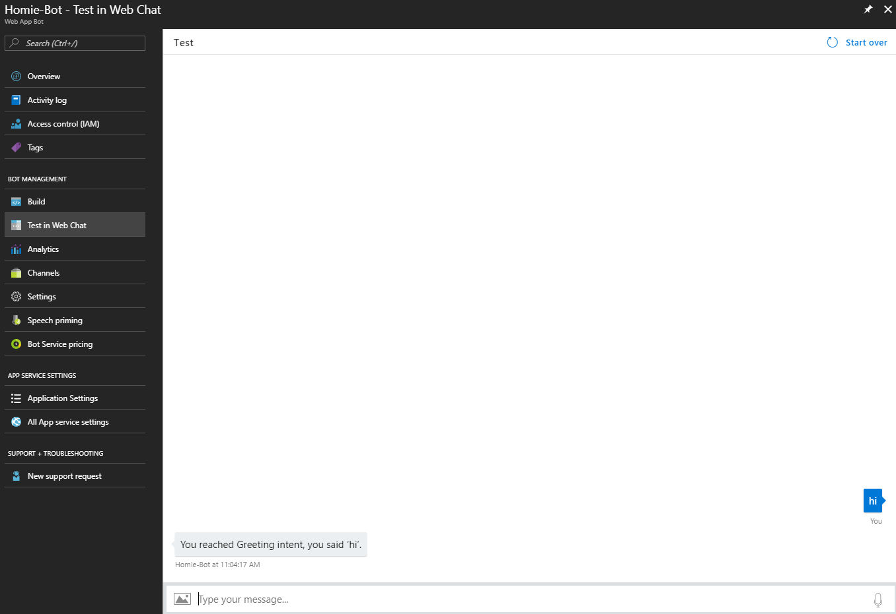
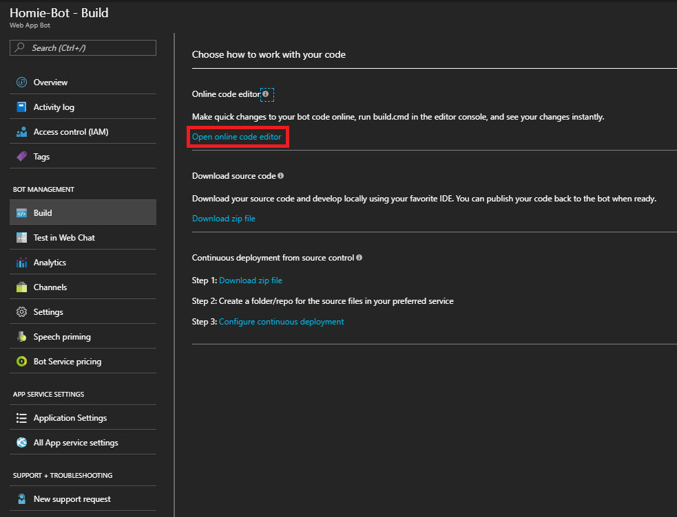
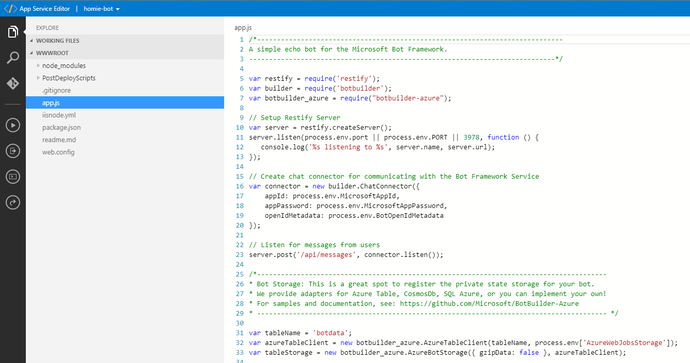
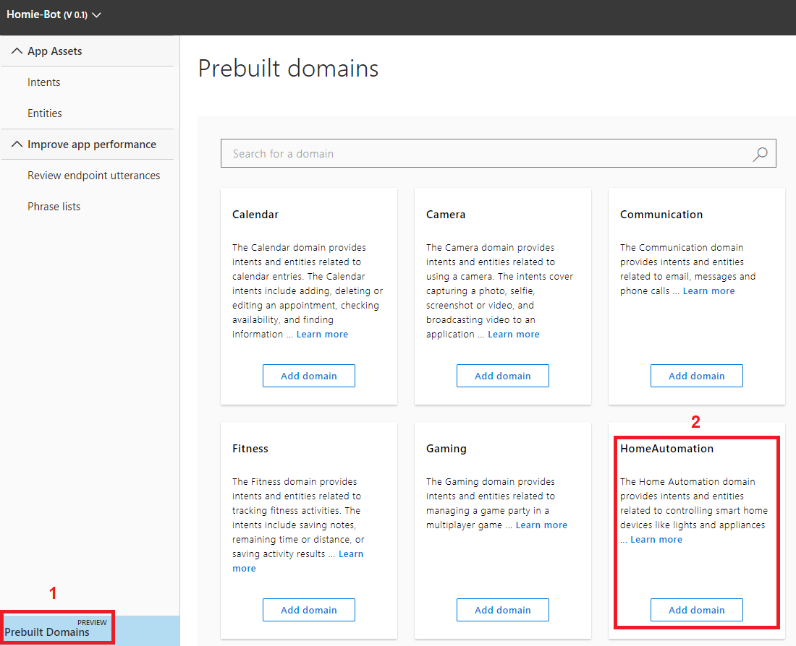
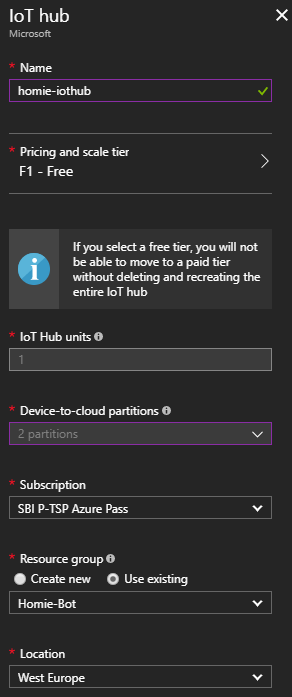

# Homie – A language understanding bot for smart homes

If you want to build your own bot running on Azure to manage your smart home, then follow the following tutorial to get started with a bot which is able to turn your lights on and off.

If you want to know more about Homie's story then please take a look at http://www.cloudguy.pro/homie-a-language-understanding-bot-for-smart-homes/

## Solution overview

### Azure Bot Service
First of all we need to create an Azure Bot service, which is responsible for communicating with the user. So head over to the Azure portal (https://portal.azure.com) and create a new bot.

In the Azure portal click on "+" and search for bot service. You can either go with a "Web App Bot" or with a "Functions Bot". In this tutorial we will use a Web App bot as this is a great way to provide a stable bot platform without the need of dealing with backend services and other stuff so you will be able to develop and deploy your bot faster.

Now we need to fill out some basic properties to give the bot a name and chosse the location as well as a pricing tier (F0 should be sufficient for developing and testing as you can upgrade when you want to deploy the bot later on). For the Bot template make sure to choose "Node.js" and then "Language understanding" as this brings a lot of preconfigured attributes within our bot solution as well as predefined code snippets which allow us to get started with the LUIS Cognitive Services API quicker. Be sure to set your App service plan and location correctly and give your Azure Storage a meaningful name.

After your bot has been created you can instantly test it when going to your bot within the Azure portal and select "Test in Web Chat" where you can type in a message to see if your bot is working. Btw you see that your bot already recognizes some basic intents like greetings as these are built in intents into your newly created LUIS app which we'll see later on.

Now we will need to adapt our bot's code to make it smarter. Therefore, the Azure portal offers a pretty nice feature as you can edit your code with the code editor built right into the portal. So head over to "Build" and the choose "Open online code editor".

Now that you opened up the App Service Editor you can select your app.js file and start developing your bot's app logic.

But before we can do that, we need to setup our other services like LUIS or our Azure IoT Hub before we can edit our code...

### LUIS
Let's start with the Cognitive Services API LUIS which is responsible for enabling our bot to detect sentiments of the users' input messages. Browse to https://www.luis.ai/applications login and select the App which has the same name as your bot to start adding entities and intents. The good thing is that there is already a prebuilt domain for HomeAutomation available which can be added to our LUIS app which saves a lot of time and effort. So click on "Prebuilt Domains" and add the "HomeAutomation" domain to our app:

Now the bot is able to detect the sentiment for turning on or off the lights or other devices in our smart home. Now we need to create the next Azure service for enabling device to cloud communication...

### Azure IoT Hub
Now head back to the Azure portal and create a new service the IoT Hub with the following attributes (Note: you can go with the F1 pricing tier for testing but you should choose at least S1 for production as you cannot switch between the free and paid tiers later on):

