# Homie – A language understanding bot for smart homes

If you want to build your own bot running on Azure to manage your smart home, then follow the following tutorial to get started with a bot which is able to turn your lights on and off.

If you want to know more about Homie's story then please take a look at http://www.cloudguy.pro/homie-a-language-understanding-bot-for-smart-homes/

## Solution overview

<p align="center"> 
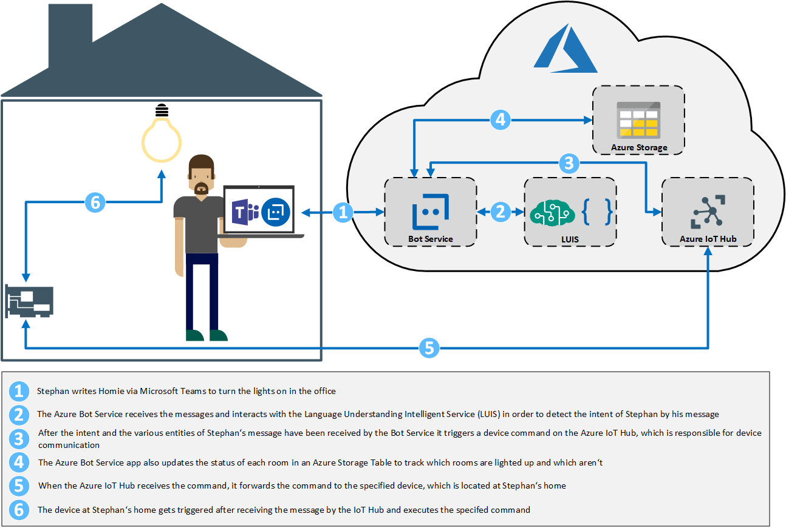
</p>

## Prerequisites

#### Azure Subscription
You need at least an Azure subscription where you can deploy your services into (either the trial or a MSDN subscription or a PAYG)
#### Raspberry Pi 3 Kit
<p align="center"> 
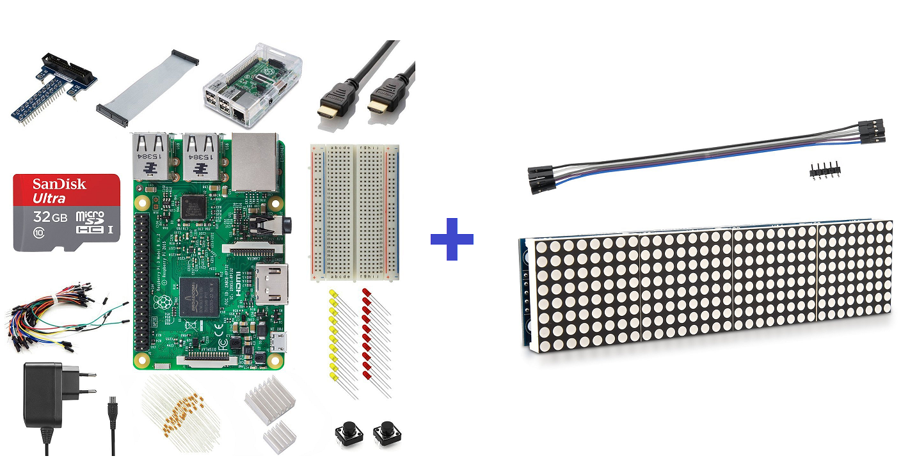
</p>

[Vilros Rasperry Pi Ultimate Starter Kit 3](https://www.amazon.de/gp/product/B01CYQJP9O/ref=oh_aui_detailpage_o01_s00?ie=UTF8&psc=1)

[kwmobile 8x32 LED Matrix Module for Raspberry Pi and Arduino](https://www.amazon.de/gp/product/B06XJ9ZX17/ref=oh_aui_detailpage_o03_s00?ie=UTF8&psc=1)

### Azure Bot Creation
First of all we need to create an Azure Bot service, which is responsible for communicating with the user. So head over to the Azure portal (https://portal.azure.com) and create a new bot.

In the Azure portal click on "+" and search for bot service. You can either go with a "Web App Bot" or with a "Functions Bot". In this tutorial we will use a Web App bot as this is a great way to provide a stable bot platform without the need of dealing with backend services and other stuff so you will be able to develop and deploy your bot faster.

<p align="center"> 

</p>

Now we need to fill out some basic properties to give the bot a name and choose the location as well as a pricing tier (F0 should be sufficient for developing and testing as you can upgrade when you want to deploy the bot later on). For the Bot template make sure to choose "Node.js" and then "Language understanding" as this brings a lot of preconfigured attributes within our bot solution as well as predefined code snippets which allow us to get started with the LUIS Cognitive Services API quicker. Be sure to set your App service plan and location correctly and give your Azure Storage a meaningful name.

<p align="center"> 

</p>

After your bot has been created you can instantly test it when going to your bot within the Azure portal and select "Test in Web Chat" where you can type in a message to see if your bot is working. Btw you see that your bot already recognizes some basic intents like greetings as these are built in intents into your newly created LUIS app which we'll see later on.

<p align="center"> 

</p>

Now we will need to adapt our bot's code to make it smarter. Therefore, the Azure portal offers a pretty nice feature as you can edit your code with the code editor built right into the portal. So head over to "Build" and the choose "Open online code editor".

<p align="center"> 

</p>

Now that you opened up the App Service Editor you can select your app.js file and start developing your bot's app logic.

<p align="center"> 

</p>

We can already add some of our Node modules and install the dependencies here, just click on "Open console" in your App Service Editor and install the following three Node modules as we need them later on in our code:

```{r, engine='bash'}
npm install azure-storage
npm install azure-iothub
npm install azure-iot-common
```

But before we can do that, we need to setup our other services like LUIS or our Azure IoT Hub before we can edit our code...

### LUIS
Let's start with the Cognitive Services API LUIS which is responsible for enabling our bot to detect sentiments of the users' input messages. Browse to https://www.luis.ai/applications login and select the App which has the same name as your bot to start adding entities and intents. The good thing is that there is already a prebuilt domain for HomeAutomation available which can be added to our LUIS app which saves a lot of time and effort. So click on "Prebuilt Domains" and add the "HomeAutomation" domain to our app:

<p align="center"> 

</p>

Now we need to train our LUIS app and publish it right from the LUIS portal (you might need to add a key here - choose your Azure subscription and the corresponding key. If you have no keys available go back to the Azure portal and create a new Cognitive Service API of type LUIS as instructed here: https://docs.microsoft.com/en-us/azure/cognitive-services/luis/azureibizasubscription).

Now the bot is able to detect the sentiment for turning on or off the lights or other devices in our smart home. Now we need to create the next Azure service for enabling device to cloud communication...

If you want to you can also add 2 more intents which can be used to check which rooms are lighted up or dark at the moment. Simply add the following two intents:

**HomeAutomation.GetLightedUpRooms**
Add the following 5 sentences to this intent and hit *Train* afterwards.
1. where is the light on?
2. where is the light on right now?
3. in which rooms are the lights on at the moment?
4. please show me all rooms where the light is on
5. show all lighted up rooms

**HomeAutomation.GetLightedOffRooms**
Add the following 5 sentences to this intent and hit *Train* afterwards.
1. where is the light off?
2. where is the light off right now?
3. show me all dark rooms
4. in which rooms are the lights off ?
5. show me all rooms where the light is off

After you trained the app you need to publish it again and that's it.

### Azure IoT Hub
Now head back to the Azure portal and create a new service the IoT Hub with the following attributes (Note: you can go with the F1 pricing tier for testing but you should choose at least S1 for production as you cannot switch between the free and paid tiers later on):

<p align="center"> 

</p>

After the IoT Hub has been provisioned you need to add your devices to it. Go to "IoT Devices" and add the devices you want to communicate with. You only need to set the Device ID and make note of the keys and the connection string after creation as we will need that later on:

<p align="center"> 
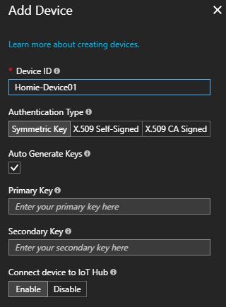
</p>

Now as we have set up all our Azure services we need to go down to our devices to make them IoT enabled...

### Azure Table Storage

Now we can add our status table in form of an Azure Storage Table to our solution. As the bot service comes with a storage account we can use that and simply add another table in there. So find your resource group where you deployed your bot in and click on the storage account in there. The find the "Tables" menu entry and click on it to add a new table with the name **lightStatus** for example:

<p align="center"> 
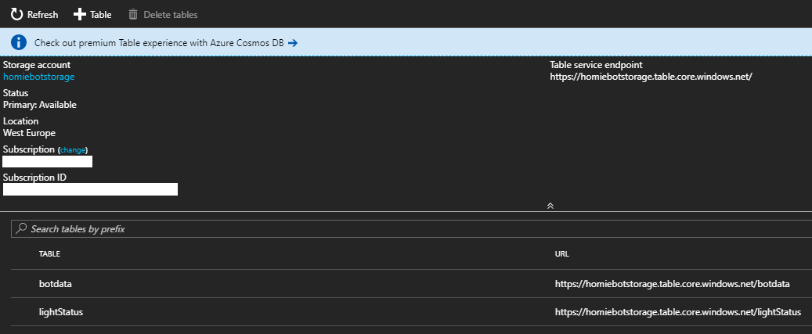
</p>

Now as the table is created we need to add some columns to it by simply opening the table in the [**Azure Storage Explorer**](https://azure.microsoft.com/en-us/features/storage-explorer/) If you haven't installed the Storage Explorer already please download and install it as this is one common tool for Azure admins and devs. After opening the Storage Explorer you should see all your tables in there as well as our newly created **lightStatus Table**:

<p align="center"> 
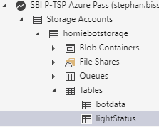
</p>

Simply select the lightStatus table click on *Add* and add at least the following 2 rows (you can add as many rows with different room names as you want):

<p align="center"> 

</p>

Now we are good to go to develop our bot's app logic...

### Raspberry PI 3

So in my case I have bought the 2 pieces from Amazon (listed in the prerequisites section) as these are pretty cheap and have everything we need to setup the desired solution. Note: I have not implemented a real light bulb in this scenario as this is not that handy for demo cases but you are good to go to connect an IoT enabled light bulb to your Pi to turn that on and off as well (should not be too much of a code change on the Pi).

So now when you get your Pi which you ordered you should already have the Raspbian image pre-installed on your SD card so you are good to go to start setting it up. I won't go into detail on how to prepare your Pi here as there are lots of blog posts which describe how to setup wifi and other related stuff like Node.Js which should usually be installed already (follow e.g.: https://www.raspberrypi.org/documentation/configuration/wireless/wireless-cli.md for instructions with the wifi setup). When you have setup your device we need to first of all connect our device with the LED matrix. So plugin the led matrix cable into your Pi's GPIO pinout as follows:

Name | Remarks | Raspberry Pi GPIO Pin | Function
------------ | ------------- | ------------- | -------------
VCC | +5V Power | 2 | 5V0
GND | Ground | 6 | GND
DIN | Data In | 19 | GPIO 10 (MOSI)
CS | Chip Select | 24 | GPIO 8 (SPI CS0)
CLK | Clock | 23 | GPIO 11 (SPI CLK)

Thanks to https://tutorials-raspberrypi.de/led-dot-matrix-zusammenbau-und-installation/ for this GPIO pinout description.

Now it's time for us to actually write some code on the Pi which allows us to connect the Pi with our IoT Hub and exchange messages with it. So take the following Node.JS code and create a new .js file on your Pi (I have created a [**Homie-Device01.js**](https://github.com/cloudguy-pro/Homie/blob/master/Raspberry_Pi/Homie-Device01.js) file as this is easy to remember the names when you have multiple devices or usecases):

```javascript
'use strict';

var clientFromConnectionString = require('azure-iot-device-mqtt').clientFromConnectionString;
var Message = require('azure-iot-device').Message;
var connectionString = [INSERT YOUR IOT HUB CONNECTION STRING HERE];
var client = clientFromConnectionString(connectionString);

var max7219LedMatrix = require('node-max7219-led-matrix');
var max7219 = new max7219LedMatrix.max7219("/dev/spidev0.0");

// GPIO pin of the led
var configPin = 7;
// Blinking interval in usec
var configTimeout = 1000;

var isLedOn = 0;

function printResultFor(op) {
  return function printResult(err, res) {
    if (err) console.log(op + ' error: ' + err.toString());
  };
}

var connectCallback = function (err) {
  if (err) {
    console.log('Could not connect: ' + err);
  } else {
    console.log('Client connected');
    client.on('message', function (msg) {
        if(msg.data == "lightsOnOffice"){
			isLedOn = +!isLedOn;
			max7219.showMessage('O');
			max7219.showMessage('O');
			max7219.clear();
			console.log('\x1b[33m%s\x1b[0m', msg.data + " - turning the lights on in the office...");
        } else if(msg.data == "lightsOffOffice"){
			isLedOn = 0;
			max7219.showMessage(' ');
			max7219.clear();
			max7219.showMessage(' ');
			max7219.clear();           
			console.log('\x1b[31m%s\x1b[0m', msg.data + " - turning the lights off in the office...");
        } else if(msg.data == "lightsOnLivingRoom"){
			isLedOn = +!isLedOn;
			max7219.showMessage('O');
			max7219.showMessage('O');
			max7219.clear();
			console.log('\x1b[33m%s\x1b[0m', msg.data + " - turning the lights on in the living room...");
        } else if(msg.data == "lightsOffLivingRoom"){
			isLedOn = 0;
			max7219.showMessage(' ');
			max7219.clear();
			max7219.showMessage(' ');
			max7219.clear();
			console.log('\x1b[31m%s\x1b[0m', msg.data + " - turning the lights off in the living room...");
        }
      client.complete(msg, printResultFor('completed'));
    });
  }
};

client.open(connectCallback);
```

**Note: Please add your IoT Hub connection string in the very beginning of the file to make it connect to the Iot Hub successfully**

After you have saved the file we need to install our Node modules with the following command from a terminal window in the path where you created the Node.JS file:

```{r, engine='bash'}
npm install azure-iot-device-mqtt --save
npm install azure-iot-device --save
npm install node-max7219-led-matrix --save
```

Now it's time to test the connection between your device and Azure, so open up a terminal on your Pi and execute the following command

```{r, engine='bash'}
sudo node [Path to your Node.JS file]/Homie-Device01.js
```

If you have done everything correctly you should see this screen:

<p align="center"> 
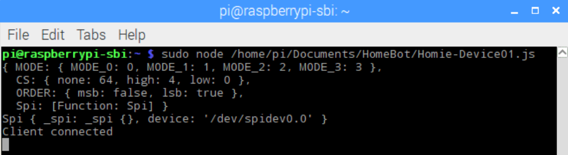
</p>

### Azure Bot Development

Now when everything is ready we can start adding some code to our bot. We actually need to replace the default code within the App Service Editor of the **app.js** file with the code from this file here: [**app.js**](https://github.com/cloudguy-pro/Homie/blob/master/Homie_Bot/app.js)

The main part of this file is the intent recognition. As an example the following code recognizes the intent of a user who wants to turn the lights on and detects the correct room name in order to tell the IoT Hub to send a device command which should turn on the lights in the correct room then:

```javascript
var restify = require('restify');
var builder = require('botbuilder');
var botbuilder_azure = require("botbuilder-azure");

// Setup Restify Server
var server = restify.createServer();
server.listen(process.env.port || process.env.PORT || 3978, function () {
   console.log('%s listening to %s', server.name, server.url); 
});

// Setup IoT Stuff
var Client = require('azure-iothub').Client;
var Message = require('azure-iot-common').Message;
var connectionString = process.env.device01connection;
var targetDevice = 'Homie-Device01';
var serviceClient = Client.fromConnectionString(connectionString);

.
.
.

// Main dialog with LUIS
var recognizer = new builder.LuisRecognizer(LuisModelUrl);
var intents = new builder.IntentDialog({ recognizers: [recognizer] })
// Intent for turning on the lights
.matches('HomeAutomation.TurnOn', (session, args) => {
    session.sendTyping();
    if(args.entities[0]) {
        var deviceEntity = builder.EntityRecognizer.findEntity(args.entities, 'HomeAutomation.Device');
        var roomEntity = builder.EntityRecognizer.findEntity(args.entities, 'HomeAutomation.Room');
        if (roomEntity){
            console.log(roomEntity['entity']);
            session.send("Ok, I will turn the %s on in the %s", deviceEntity['entity'], roomEntity['entity']);
            session.endDialog();
			if (deviceEntity['entity'] == "lights" && roomEntity['entity'] == "office"){
				var myCommand = "lightsOnOffice";
				var message = new Message(myCommand);
				message.ack = 'full';
				message.messageId = "My Message ID";
				console.log('Sending message: ' + message.getData());
				serviceClient.send(targetDevice, message);
                var entity = {
                    PartitionKey : 'office',
                    RowKey: '1',
                    Room: 'Office',
                    Status: 'On'
                };
                statusTableSvc.insertOrReplaceEntity('lightStatus', entity, function(error, result, response) {
                    if (!error) {
                        console.log("done writing to Azure Storage table");
                    } else {
                        console.log(error);
                    }
                });
		} else if (deviceEntity['entity'] == "lights" && roomEntity['entity'] == "living room"){
				var myCommand = "lightsOnLivingRoom";
				var message = new Message(myCommand);
				message.ack = 'full';
				message.messageId = "My Message ID";
				console.log('Sending message: ' + message.getData());
				serviceClient.send(targetDevice, message);
                
			var entity = {
			    PartitionKey : 'livingRoom',
			    RowKey: '2',
			    Room: 'Living Room',
			    Status: 'On'
			};
			statusTableSvc.insertOrReplaceEntity('lightStatus', entity, function(error, result, response) {
			    if (!error) {
				console.log("done writing to Azure Storage table");
			    } else {
				console.log(error);
			    }
			});
		}
        }
        
    }
})

. 
.
.
```

**Note: We need to make sure we have set the connection string of the IoT device in our Application Settings of the bot as we don't want to have global parameters or passwords in our bot's code**
So head over to the Bot in the Azure portal go to Application Settings and insert your connection string as follows:

<p align="center"> 
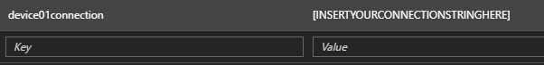
</p>

No when you run the Node.JS file on your PI your LED lights should look like this:

<p align="center"> 
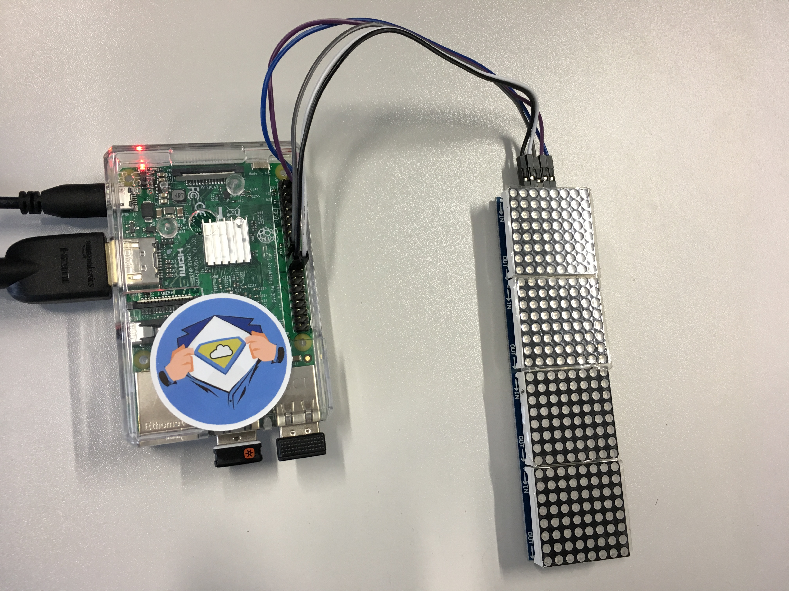
</p>

Now when we type in the message **"Turn the lights on in the office"** into the bot's Web Chat (just click on "Test in Web Chat" in the Azure portal on your bot's site) you should see the following on your device's temrinal window:

<p align="center"> 
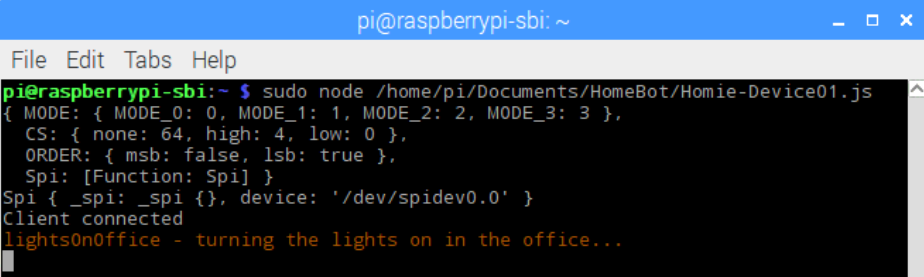
</p>

Amd your LED lights should look like this:

<p align="center"> 
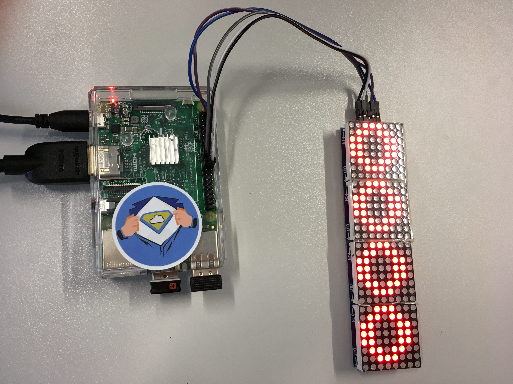
</p>

And the bot should send you the following message back in your emulator:

<p align="center"> 
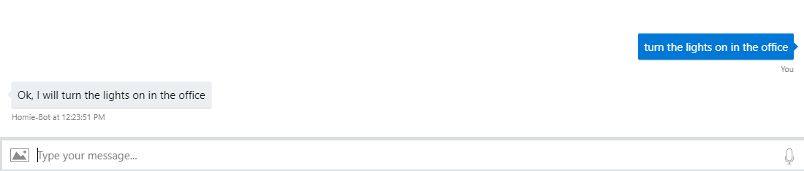
</p>

Now can also ask your bot **"Show all lighted up rooms"** the bot should answer this with the following:

<p align="center"> 
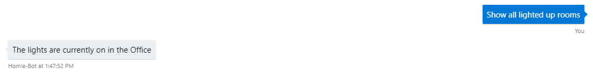
</p>

Now you're good to go to add your bot to your favourite [**channels**](https://docs.microsoft.com/en-us/bot-framework/bot-service-manage-channels) like Microsoft Teams, Skype, Slack or Facebook to make it available for your users to interact with the bot...

<p align="center"> 
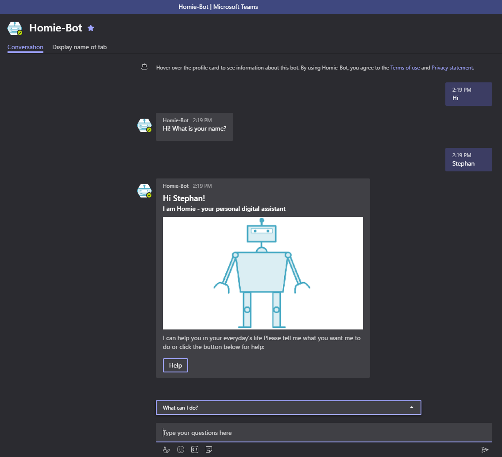
</p>

