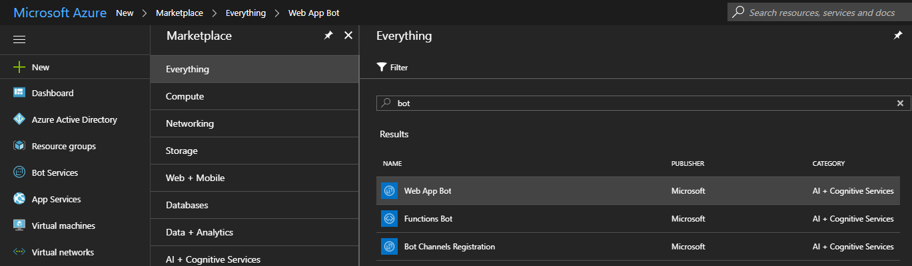
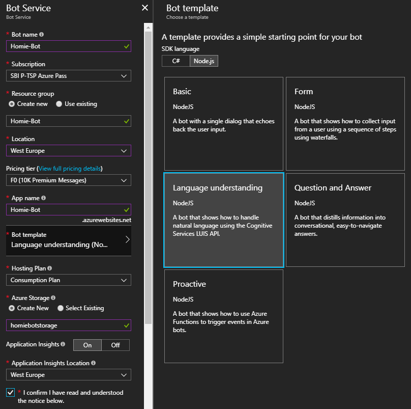

# Homie
“Homie” – A language understanding bot for smart homes

If you want to build your own bot running on Azure to manage your smart home, then follow the following tutorial to get started with a bot which is able to turn your lights on and off.

If you want to know more about Homie's story then please take a look at http://www.cloudguy.pro/homie-a-language-understanding-bot-for-smart-homes/

## Solution overview

### Azure Bot Service
First of all we need to create an Azure Bot service, which is responsible for communicating with the user. So head over to the Azure portal (https://portal.azure.com) and create a new bot.

In the Azure portal click on "+" and search for bot service. You can either go with a "Web App Bot" or with a "Functions Bot". In this tutorial we will use a Web App bot using a Consumption plan which is a serverless bot running on Azure Functions as this is a great way to provide a stable bot platform without the need of dealing with backend services and other stuff so you will be able to develop and deploy your bot faster.

Now we need to fill out some basic properties to give the bot a name and chosse the location as well as a pricing tier (F0 should be sufficient for developing and testing as you can upgrade when you want to deploy the bot later on). For the Bot template make sure to choose "Node.js" and then "Language understanding" as this brings a lot of preconfigured attributes within our bot solution as well as predefined code snippets which allow us to get started with the LUIS Cognitive Services API quicker.

