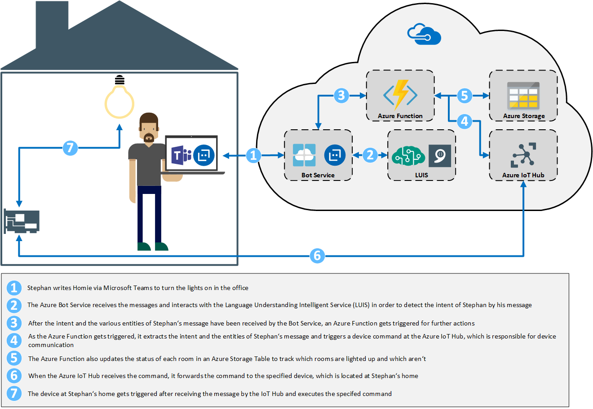

# Homie
“Homie” – A language understanding bot for smart homes

If you want to build your own bot running on Azure to manage your smart home, then follow the following tutorial to get started with a bot which is able to turn your lights on and off.

If you want to know more about Homie's story then please take a look at http://www.cloudguy.pro/homie-a-language-understanding-bot-for-smart-homes/

## Solution overview

### Azure Bot Service
First of all we need to create an Azure Bot service, which is responsible for communicating with the user. So head over to the Azure portal and create a new bot.
